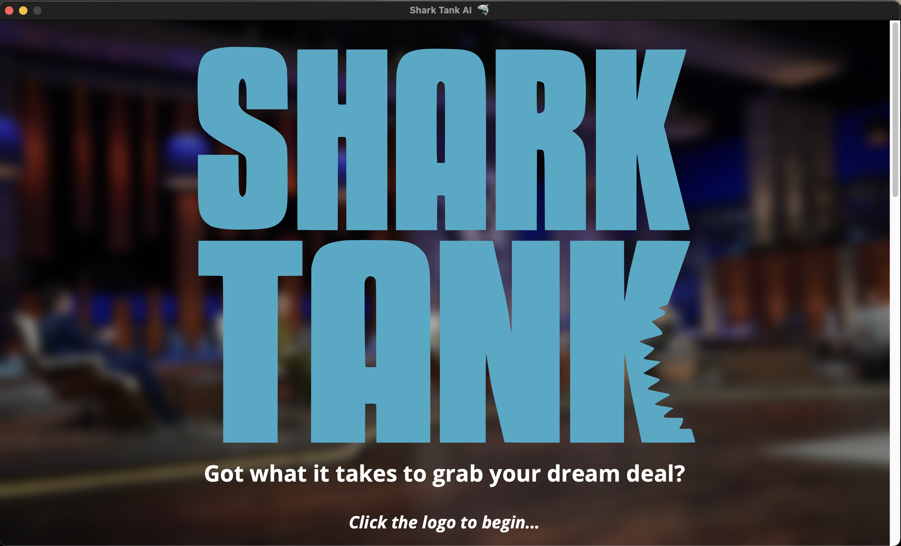
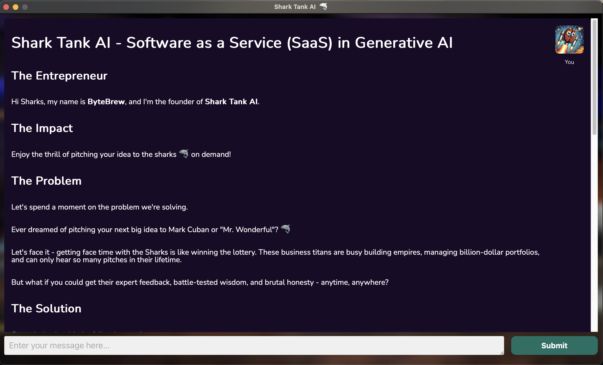
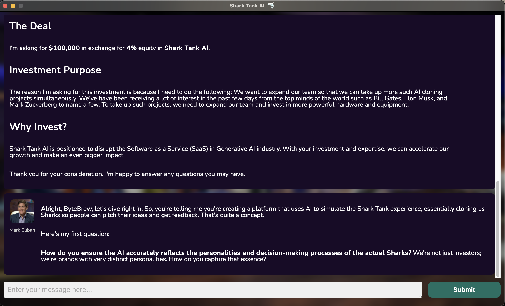
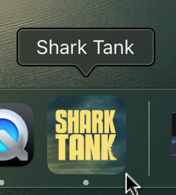

# Shark Tank 🦈

 Experience the thrill of pitching your idea to the sharks 🦈 on demand!

## Why did I build this?

I've been a big fan of Shark Tank 🦈 since I was a kid. After years of being a devoted fan, I found myself yearning to experience the exhilarating feeling of pitching an idea or product directly to the Sharks.

The show has always captivated me with its dynamic interactions and high-stakes negotiations, and I realized that many others might also share this fantasy.

This realization inspired me to build an application that simulates the pitching experience, utilizing the latest LLMs from Perplexity's Sonar APIs.

My goal is to create a platform where aspiring entrepreneurs can practice their pitches, receive real-time feedback, and immerse themselves in the thrill of presenting their ideas—just like on the show.

Through this app, I hope to help others live out their Shark Tank fantasies and gain the confidence they need to make their entrepreneurial dreams a reality.

## Quick Start

1. Clone the repository
1. Run the command `wails dev` at the project root location.

## Video

* [Vimeo Link](https://vimeo.com/1062106020?share=copy)

## X (formerly known as Twitter)

* [Tweet Link](https://x.com/Elixir_Exchange/status/1896624007069548544)

## Screenshots

### Landing Screen

### Idea Form

### Idea Pitch & Chat Screen

### Shark Tank AI Application Logo

---
