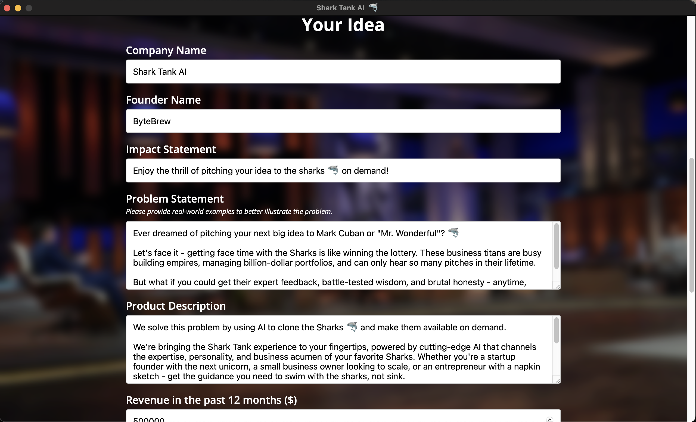

# Shark Tank 🦈

 Experience the thrill of pitching your idea to the sharks 🦈 on demand!

## Quick Start

1. Clone the repository
1. Run the command `wails dev` at the project root location.

## Video

* [Vimeo Link](https://vimeo.com/1062106020?share=copy)

## X (formerly known as Twitter)

* [Tweet Link](https://x.com/Elixir_Exchange/status/1896624007069548544)

## Screenshots

### Landing Screen

### Idea Form

### Idea Pitch & Chat Screen

### Shark Tank AI Application Logo

---
